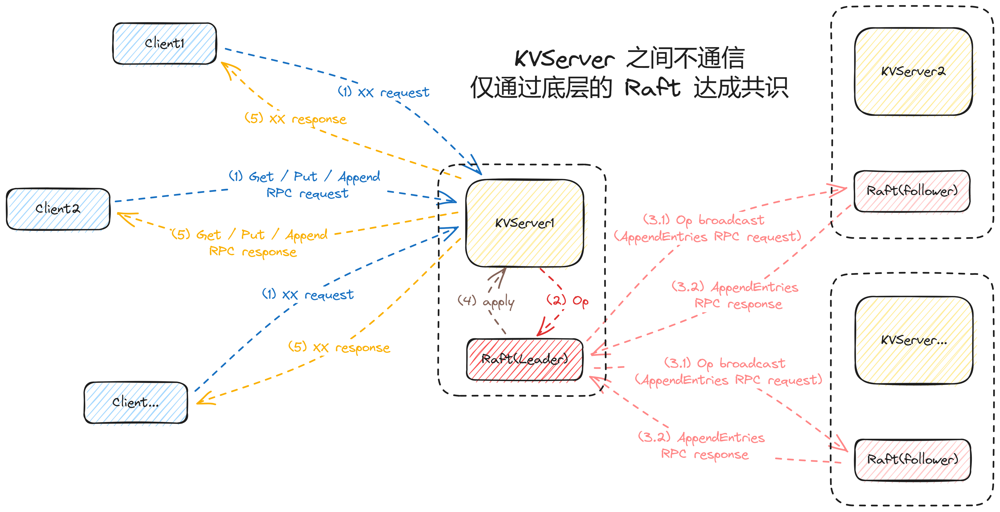
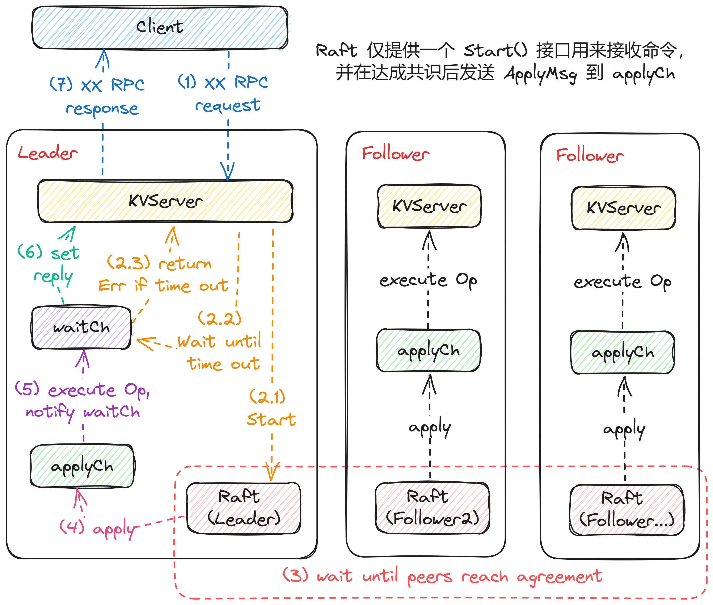
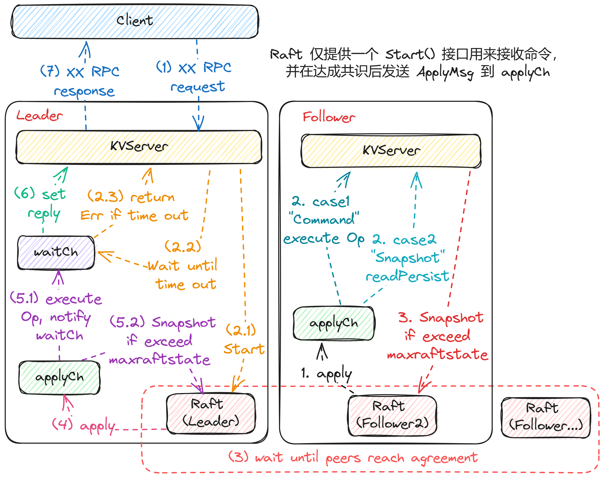

# Lab 4: Fault-tolerant Key/Value Service

## Lab4A Key/value service without snapshots

###  目标

利用Lab3中实现的Raft库，来构建键值服务器`KVServer`，构建客户端`Clerk`。构建的`KVserver`需要支持`Put(),Append(),Get()`操作，并且所有操作需要满足`线性一致性`。

### 具体细节

* `Clerk`将`Put(),Append(),Get()`操作的`RPC`请求发送到关联`Raft`为领导者的`KVServer`，`KVServer`将`Put/Append/Get`操作提交给`Raft`，以便`Raft`日志保存操作序列，当对应的操作被`Commit`时，会通过`Chan`返回给`KVServer`，同时`KVServer`再返回给对应的`Clerk`。
* 所有的`RPC`请求，`Clerk`都会发送到`Leader`节点，如果发送给的是非`Leader`节点，那么`Clerk`将会换一个`KVServer`继续尝试。
* 要保证`Clerk`重新发送请求不会导致服务器多次执行同一请求。通过`LastRequestMap map[int64]int64`实现，来保存每个客户端最近的一次请求ID。
* `KVServer`之间不通信，仅通过底层的`Raft`达成共识。

* `Client`给`KVServer`发送`RPC`请求
* `KVServer`封装成`Op`发送给`Raft`的`Start()`函数提交日志
* 底层的`Raft`达成共识
* `apply`该命令让`KVServer`进行处理
* `KVServer`给`Client`返回`RPC`请求

* `Client`找到为`Leader`的`KVServer`，如果找到就一直尝试，直到找到。找到后发送`RPC`请求
* 作为`Leader`的`KVServer`发给自己所代表的`Raft`，让底层`Raft`达成共识。同时`Server`会启动`waitChMap map[int]chan *Op`通道等待执行结果。
* `Raft`提交该索引`Index`所代表的该命令后会通过`applyCh`发送到`KVServer`，`KVServer`接受到后分析该已被`commit`的命令，并执行，执行的结果返回给`waitCh - chan *Op`
* 最后`KVServer`的通道`waitCh `接受到消息后，处理并返回给`Clerk`

注意，即使该次请求超时了`Clerk`也会再发送请求。只要是达成共识的命令必须执行(当然需要判断是否重复命令或者是过期的`RPC`)

* 若当前命令是`Put/Appened`，首先会检查是否为重复命令或是否为过期的`RPC`请求(过期的`RPC`请求之前已经执行过了)，若发现是已经执行过或为过期的`RPC`请求，都会直接返回`OK`。
* 若当前命令是`Get`直接执行，不作检查

## Lab4B Key/Value service with snapshots

### 目标

目前`Key/Value Server`不会调用`Raft`的`Snapshot()`快照方法，因此重新启动的服务器必须加载完整的持久`Raft`日志才能恢复其状态。现在需要使用`Lab3D`中的快照函数，修改`KVServer`以及`Raft`配合以节省日志空间并减少重新启动时加载的时间。

### 具体细节

* 每当`KVServer`检测到`Raft`状态大小`persister.RaftStateSize()`接近`maxraftstate`这个阈值时，它会调用`Raft`的`Snapshot`来保存快照。

* 每次命令执行完成后，检查状态看是否需要进行快照
* 接受到快照是，需要判断是否为最新的快照，是最新的快照的话需要读取快照信息并更新自身状态

