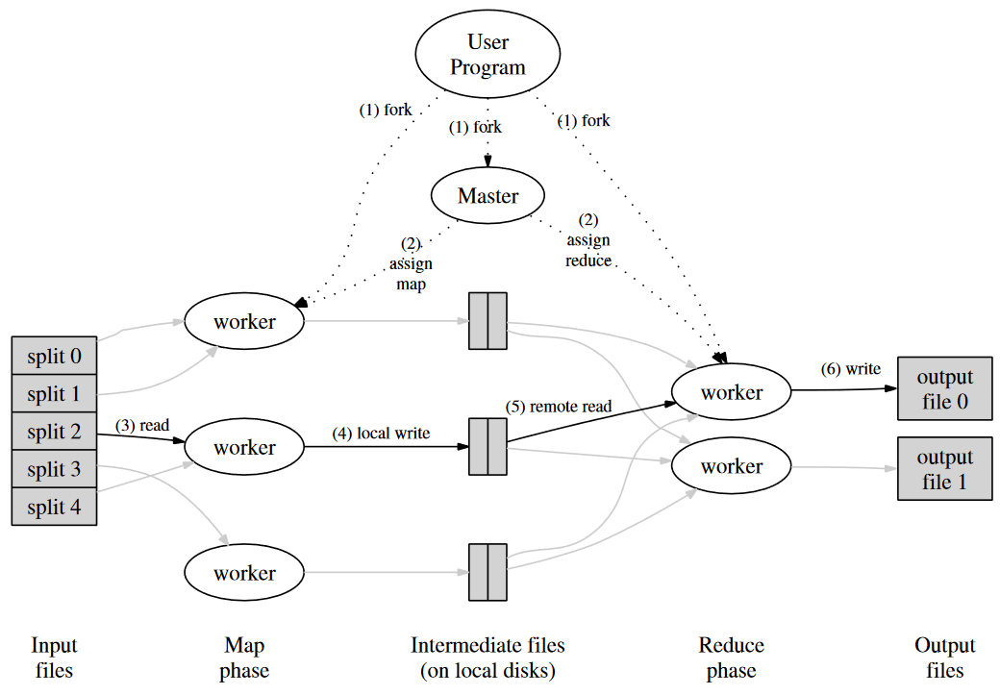
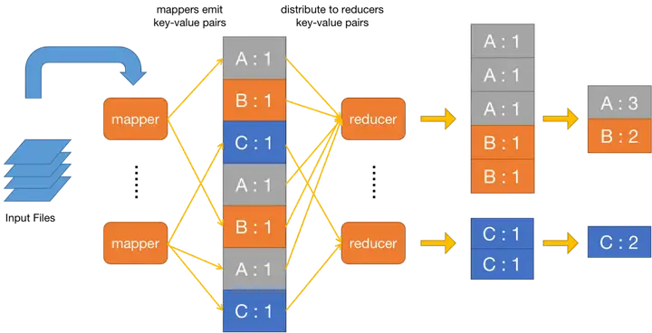
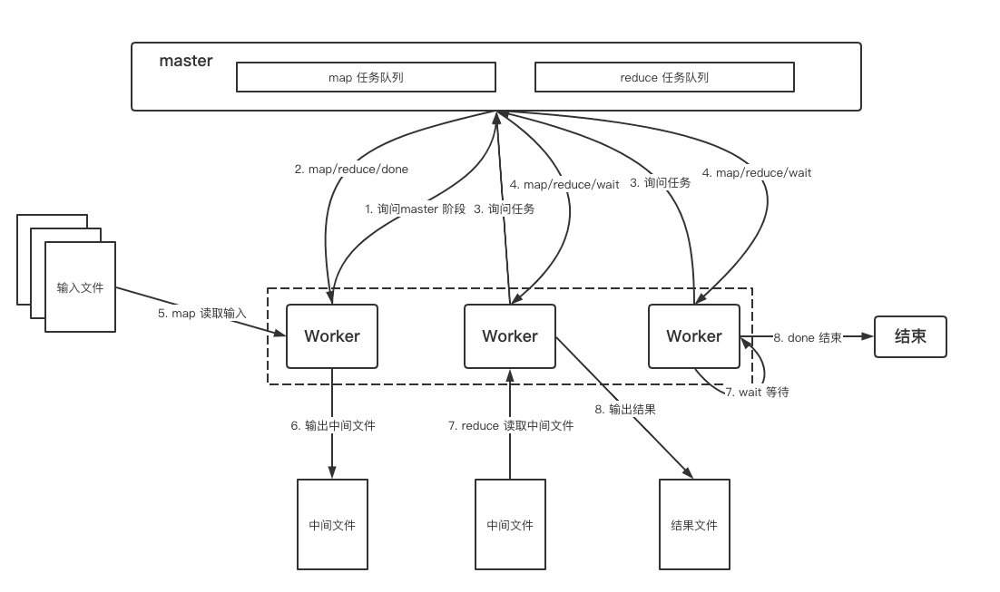

# Lab1-MapReduce

## 实现目标

实现一个简易版本的分布式MapReduce，并通过`test-mr.sh`中的所有测试

* MapReduce

​	其思想是让应用程序设计人员和分布式运算的使用者，只需要编写`Map`函数和`Reduce`函数，而不需要知道有关分布式的事情，MapReduce框架会处理剩下的事情

* 整体流程

​	`Worker`会定期询问`Master`分配任务，如果`Map`任务还没有执行结束，则`Master`会先分配`Map`任务，所有的`Map`任务结束后才会开始分配`Reduce`任务。

​	如果有的`Worker`超过`10s`还没有完成任务，那么`Master`会重新分配该任务给其他`Worker`。

* `Map`任务

​	`mapf`函数需要传入的参数是`(Filename, content)`分别是文件名字和文件内容，该函数会将该文件内的所有内容分割为`(Key, Value)`的形式表示单词和对应次数，在`Map`任务中每个单词的`Value`目前都是`1`

​	注意，`Map`任务中的单词分隔还会按照`Key`的`Hash`值去的映射到对应桶(总共有`nReduce`个桶)中，这样的映射可以保证相同的`Key`值被同一个`Reduce`任务处理。

​	`Map`处理完成后会把生成中间文件`mr-X-Y`，其中`X`表示对应的`Map`任务编号`Y`是对应的`Reduce`任务编号

* `Reduce`任务

  

​	执行`Reduce`任务时，会读取中间文件，将中间文件中的`(Key, Value)`整合，如上图中，原本散乱的`A:1`经过`Map`任务会存储到同一个中间文件，该中间文件被对应`Reduce`读取后，按照字典序排序然后整合，最终得到`A:3`的形式

## 整体流程

