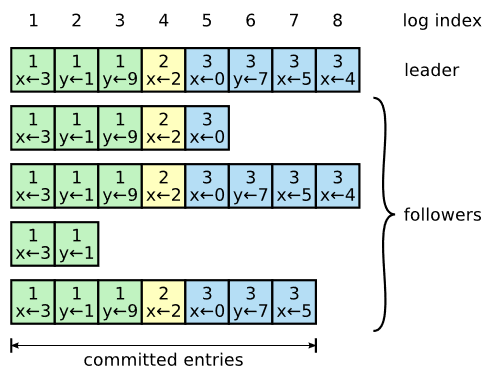

# Lab3 Raft

## Lab3A-领导选举(Leader Election)

### 目标

​	实现`Raft`的`Leader`选举和心跳，此时是不需要追加日志条目的。`Lab3A`我们需要选出一个单一的`Leader`，并且在旧`Leader`出现瘫痪或者数据包丢失的情况下，由新`Leader`接管丢失的。

### 具体细节

* Follower

普通的节点，这些节点可以在超时后转换为`候选者`等待投票。

* Candidate

`候选者`，每个节点都可以有权转换为`候选者`，但是如果已经有`Leader`那么所有的候选者都要在接收到心跳后恢复到`Follower`。

* Leader

`Leader`是超时选举的，每个节点都会`rand`一个在`[250,400]ms`的等待时间，如果超过这个时间没有接收到心跳，该节点就会转变为`Candidate`然后邀请其他节点给自己投票。

`Leader`会定期发送心跳，在该程序中每`100ms`发送一次心跳。如果一个节点能接收到`Leader`发送的心跳，那么会重置自己的`rand`。

* 为什么这里能保证只选举出一个`Leader`?

论文中提到节点的个数一直保持是奇数个，一个节点想要成为`Leader`那就必须得到一半以上的选票(一个节点只会投一票)，只有一个节点可以得到一半以上的选票，因此可以保证只选举出一个`Leader`。

* `Candidate`依据什么投票？

  * 整个程序中会有一个`Term`任期的概念，每个节点都会用`currentTerm`变量来表示自己当前所处的任期。

  * 如果`Candidate`节点的当前任期大于`server`，那么`server`就会投票给`Candidate`，多个`Candidate`都给同一个`server`发送请求时，采取先到先得的思想。一个`Follower`**只会投一票**。投票过后会重置自己的选举超时计时器。

  * 当`Candidate`的任期和`server`相同是在`Lab3B`的时候会对日志的新旧程度进行判断，如果`Candidate`的日志比`server`的新，那么`server`也会投票给`Candidate`。

  * 一个`Follower`变为`Candidate`时候，任期`Term++`。一个`server`投票完成后，会把自己的任期`Term`变为和`Candidate`一样的任期。每个`Candidate`都会投票给自己。

    

## Lab3B-日志(log)

### 目标

实现`Leader`和`Follower`的代码以实现附加新日志条目。

### 具体细节

* Raft是强`Leader`政策，所有log都先交给`Leader`处理，由`Leader`复制给其他`Follower`，当这条log被半数以上节点接受后，会被提交到状态机上，同时一个log被半数节点接受后会`commit`，之后也不会发生覆盖该log的情况。

* 上图中的`Leader`日志长度为8，`Leader`的日志长度能表示哪些信息呢？

  * `Leader`日志上除最新的以外都是已经被`commit`的，绝对不会发生覆盖和修改的，也就是说`1-7`的日志都已经被确认
  * 观察`Follower`，我们发现有一部分的节点日志条目缺很多，这该怎么办呢？
    * `Leader`会定期发送心跳给各个节点，在发送心跳的同时会检查`Follower`的日志是否和自己的完全一样，如果不一样，`Follwer`就会告诉`Leader`下次请附带日志给我。

* `Follower`短缺的日志，`Leader`如何进行同步呢？

  * 每次`Leader`节点发送心跳时都会检查自己的`rf.nextIndex[server]`是多少

    * `rf.nextIndex[server]`是指`rf`对象(在这里认为是`Leader`)下一个需要给`server`发送的日志条目的`Index`。通过该变量我们会将需要发送给`server`的日志添加到`args:AppendEntriesArgs`的结构体中，讲该参数发送给`server`。
    * 有的时候`Leader`发送的日志是可能会覆盖`Follower`的日志的，因为`Follower`的部分日志可能是没有提交的，没有提交的日志是允许被覆盖的。在`server`中找到该添加日志的位置后，会直接`append`到`server`的`log[]`中

  * 可能会发生`Leader`和`Follower`的匹配`nextIndex[server]`不匹配

    * 此时我们需要减小`nextIndex[server]`一种朴素的方法是每次`nextIndex[] - 1`

    * 论文中提到更快的方式是跳过一个不匹配的`Term`，按照`Term`来增快匹配速度，`Raft`实验在`Lab3C`中因为速度要求，我们必须实现这种匹配。`Lab3B`中，我们可以使用朴素的方法。

    * 注意对于每个节点刚成为`Leader`时，会将`nextIndex[]`初始化自己日志的最后一个`Index`，因此会出现上述提到的`nextIndex[]`不匹配的情况。`matchIndex[]`每次初始化的时候都是`0`。

      

该图是上边问题在论文中的一个解释，具体可以在论文`Figure 7`中找到该图和对应的解释。

* 在判断`Leader`日志和`server`日志的新旧程度时，是根据

## Lab3C-持久化(persistence)

### 目标

基于Raft的服务器如果重新启动，他应该从中断处恢复服务。这要求Raft保持在重启后仍然存在持久状态。论文中的`Figure 2`提到了哪些状态应该持久化。

* Raft的持久状态每次发生状态时将其写入磁盘
* 重新启动时可以从磁盘读取状态

### 具体细节

* 实现`persist`函数中的`encodeState`，我们将需要持久化的`currentTerm,voteFor,log`编码为字节数组，然后保存
* 在所有持久化变量改变的地方执行`rf.persist()`

* 每个`Leader`只能确定自己`Term`的日志，旧`Leader`的日志只能伴随着新`Leader`日志的`commit`而确认，这样保证安全

在 (a) 中，S1 是领导者，并部分复制索引 2 处的日志条目。在 (b) 中，S1 崩溃； S5 凭借 S3、S4 和自身的投票当选为第 3 期的领导者，并接受日志索引 2 处的不同条目。在 (c) 中，S5 崩溃； S1 重新启动，当选为领导者，并继续复制。此时，第 2 项的日志条目已复制到大多数服务器上，但尚未提交。如果 S1 如 (d) 所示崩溃，S5 可以当选领导者（通过 S2、S3 和 S4 的投票）并用第 3 期中自己的条目覆盖该条目。但是，如果 S1 在大多数服务器崩溃之前，如（e）所示，然后该条目被提交（S5 无法赢得选举）。

* 在上述的情况中发生了，旧的日志条目已经存储在大多数服务器上`commit`，但是仍然会被未来的`Leader`覆盖。为了消除这种情况，Raft采用`Leader`只提交自己任期的log；以这种方式提交log，则由于日志匹配属性，所有先前的条目都会间接提交。
* 每个`Leader`只能提交自己所在`Term`的日志。针对上述场景，问题发生在阶段c，即使作为 term4 leader 的 S1 将 (term2, index2) 复制给了大多数节点，它也不能直接将其 commit，而是必须等待 term4 的日志到来并成功复制后，一并进行 commit。

## Lab3D-快照

### 目标

按照目前的情况，重新启动服务器会重放完整的Raft日志以恢复其状态。然而，对于一个长期运行的服务来说，永远记住完整的Raft日志是不切实际的。在本次实验中，我们要实现`快照`服务，此时Raft会丢弃快照之前的日志条目。这样使得持久数据量更小，重启速度更快。

当然也会存在`Follower`落后的太远，以至于`Leader`已经丢弃了它需要赶上的日志条目，未解决此问题`Leader`只需要发送最新的快照以及快照开始的日志即可。

### 具体细节

* `Leader`每次在发送心跳的时候都会先检查`server`的日志是否最新的，判断是否需要给`server`发送快照
* `server`在接收快照后，还需要根据`reply`去更新`matchIndex[]`和`nextIndex[]`
* 因为快照的出现，所有`log[]`的访问索引会出现不是从`1`开始的情况，此时我们需要用`相对下标`来处理日志。

